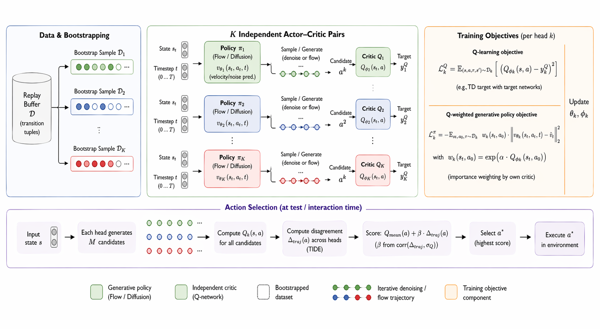

# Principled Ensemble Exploration for Generative RL Policies

[](https://www.python.org/downloads/release/python-390/)
[](https://github.com/google/jax)
[](LICENSE)

> We prove that naive ensemble exploration fails for generative RL policies due to a gradient alignment failure mode, and introduce BootFlow with independent Q-targets and TIDE exploration to resolve it. Up to 7x improvement on MuJoCo locomotion.
>
> **[Report](https://drive.google.com/file/d/1VQIPrwMNuE8TFQq6mTTeI1EP9OQJCRyJ/view?usp=sharing)** &nbsp;|&nbsp; **Built on [SDAC](https://arxiv.org/abs/2502.00361) (Ma et al., ICML 2025)**



---


Run any experiment:
```bash
XLA_FLAGS='--xla_gpu_deterministic_ops=true' CUDA_VISIBLE_DEVICES=0 XLA_PYTHON_CLIENT_MEM_FRACTION=.1 \
  python scripts/train_fullbootflow.py --num_heads 5 --exploration ucb --redq_m 2 <env flag> --seed 100
```

---

## Progress

### Done
- [x] Vanilla SDAC verified on HalfCheetah-v4 (12,528 return at 900K steps)
- [x] Multi-head velocity network (shared backbone + K output heads)
- [x] Thompson Sampling (per-episode head selection with trainer hooks)
- [x] Bootstrap mask support (random on-the-fly + stored in buffer modes)
- [x] Head disagreement metric logged during training
- [x] Video recording script with tracking camera and checkerboard floor
- [x] MetaWorld environment support (auto-detection, single-env fallback)
- [x] Unified training script with progressive feature flags (K=1 = vanilla SDAC)
- [x] K=1 BootFlow verified bit-identical to vanilla SDAC
- [x] Randomized prior functions (Osband et al. 2018) for head diversity maintenance
- [x] Disagreement exploration bonus (Pathak et al. 2019) as intrinsic reward
- [x] Diversity loss (MED-RL, ICLR 2022) to prevent head collapse in policy loss
- [x] Loss normalization fix (divide by K heads — critical for Ant-v4 and harder envs)
- [x] Per-env Thompson sampling (each vectorized env tracks its own head)
- [x] UCB exploration mode (`--exploration ucb`) — pool K×N candidates, select by Q + beta x disagreement
- [x] Q-Weighted Head Voting pipeline (`scripts/train_qvoting.py`)
- [x] AdaFlow implementation — K Q-ensemble critics with REDQ, Thompson on Q-networks, adaptive best-of-N
- [x] FullBootFlow (K heads + K Q-networks) — 3.5x returns on Ant-v4 locomotion
- [x] W&B project separation (`--wandb_project`, auto: `metaworld` for -v3 envs)
- [x] W&B logging fix: separate step axes for sample/update/episode metrics
- [x] Per-episode return logging (`episode/return` vs `episode/count`)
- [x] `--updates_per_step` flag for data-starved single-env settings (MetaWorld)
- [x] MetaWorld video recording script (`scripts/record_video_metaworld.py`)
- [x] SDAC baseline on push-v3 (returns ~3087 at 1M steps)
- [x] Flow matching policy (`--flow_matching`) as alternative to DDPM for all pipelines
- [x] FullBootFlow Flow Matching UCB K=5: ~5x returns on Ant-v4 (best result)
- [x] Improve BootFlow returns on MetaWorld (currently marginally better than vanilla SDAC)
- [x] Test FullBootFlow K=5 with `--updates_per_step 5` on MetaWorld
- [x] Log MetaWorld `success_rate` from `info["success"]`
- [x] BootFlow UCB K=5 on MetaWorld manipulation tasks
- [x] Test FullBootFlow K=2 UCB on MetaWorld (less data hunger)
- [x] Test on harder MetaWorld tasks: peg-insert-side-v3, shelf-place-v3, sweep-into-v3
- [x] Multi-seed runs on locomotion (Ant-v4, HalfCheetah-v4, Walker2d-v4) for paper
- [x] Core assumption testing
- [x] BootFlow ablations — vary K in {1,2,3,5,10}, bootstrap mask p in {0.0,0.6,1.0}
- [x]  Evaluate FPO, QVPO, SAC as baseline                               


## Quick Start

### Install

```bash
uv venv --python 3.9 && source .venv/bin/activate
uv pip install "jax[cuda12]==0.4.27" -f https://storage.googleapis.com/jax-releases/jax_cuda_releases.html
uv pip install -r requirements.txt && uv pip install -e .
```

<details>
<summary>Alternative: conda</summary>

```bash
conda create -n bootflow python=3.9 -y && conda activate bootflow
pip install "jax[cuda12]==0.4.27" -f https://storage.googleapis.com/jax-releases/jax_cuda_releases.html
pip install -r requirements.txt && pip install -e .
```
</details>

### Reproduce main result

```bash
# FullBootFlow UCB K=5 (Table 1, Row 1)
XLA_FLAGS='--xla_gpu_deterministic_ops=true' CUDA_VISIBLE_DEVICES=0 XLA_PYTHON_CLIENT_MEM_FRACTION=.1 \
  python scripts/train_fullbootflow.py \
    --num_heads 5 --exploration ucb --ucb_beta 1.0 --redq_m 2 \
    --env Ant-v4 --seed 100
```

```bash
# FullBootFlow TIDE K=5 (Table 1, Row 1, TIDE variant)
XLA_FLAGS='--xla_gpu_deterministic_ops=true' CUDA_VISIBLE_DEVICES=0 XLA_PYTHON_CLIENT_MEM_FRACTION=.1 \
  python scripts/train_fullbootflow.py \
    --num_heads 5 --exploration idfm --idfm_beta 2.0 --idfm_mode corr --redq_m 2 \
    --env Ant-v4 --seed 100
```

```bash
# SDAC baseline (K=1, reduces to vanilla SDAC)
XLA_FLAGS='--xla_gpu_deterministic_ops=true' CUDA_VISIBLE_DEVICES=0 XLA_PYTHON_CLIENT_MEM_FRACTION=.1 \
  python scripts/train_bootflow.py --num_heads 1 --env Ant-v4 --seed 100
```

### With flow matching backbone

Add `--flow_matching` to any command above:

```bash
XLA_FLAGS='--xla_gpu_deterministic_ops=true' CUDA_VISIBLE_DEVICES=0 XLA_PYTHON_CLIENT_MEM_FRACTION=.1 \
  python scripts/train_fullbootflow.py \
    --num_heads 5 --exploration ucb --redq_m 2 --flow_matching \
    --env Ant-v4 --seed 100
```

### Multiple seeds

```bash
for SEED in 100 200 300; do
  XLA_FLAGS='--xla_gpu_deterministic_ops=true' CUDA_VISIBLE_DEVICES=0 XLA_PYTHON_CLIENT_MEM_FRACTION=.1 \
    python scripts/train_fullbootflow.py \
      --num_heads 5 --exploration ucb --redq_m 2 --env Ant-v4 --seed $SEED &
done
```

Run `python scripts/train_fullbootflow.py --help` for all available flags.


---

## Project Structure

```
                                                                                                                                                                                          
  ├── scripts/                                                                                                                                                                                 
  │   ├── train_fullbootflow.py        # FullBootFlow: K heads + K Q-nets (main method)                                                                                                        
  │   ├── train_bootflow.py            # BootFlow: K heads, shared twin-Q                                                                                                                      
  │   ├── train_mujoco.py              # SDAC + 9 baselines (--alg sdac|sac|...)                                                                                                               
  │   ├── evaluate_checkpoints.py      # Batch evaluation across seeds                                                                                                                         
  │   └── inspect_results.py           # Plot training curves from log.csv                                                                                                                     
  │                                                                                                                                                                                            
  ├── relax/                                                                                   
  │   ├── algorithm/                                                                           
  │   │   ├── sdac_fullbootflow.py     # FullBootFlow algorithm (UCB, Thompson, TIDE)
  │   │   ├── sdac_bootflow.py         # BootFlow (shared Q variant)                           
  │   │   └── sdac.py                  # Original SDAC 
  │   │                                       
  │   ├── network/                                                                             
  │   │   ├── diffv2_fullbootflow.py   # K-head + K Q-net architecture 
  │   │   └── diffv2_bootflow.py       # K-head + shared Q architecture                        
  │   │                                                      
  │   ├── utils/                               
  │   │   └── diffusion.py             # GaussianDiffusion + FlowMatching classes                                                                                                              
  │   │                                                                                                                                                                                        
  │   └── trainer/                                                                                                                                                                             
  │       ├── off_policy.py            # Training loop with Thompson hooks                     
  │       └── evaluator.py             # Parallel evaluation subprocess
  │
  └── requirements.txt                      
```

---

## Baselines

```bash
# SDAC (diffusion policy, our base method)
XLA_FLAGS='--xla_gpu_deterministic_ops=true' CUDA_VISIBLE_DEVICES=0 XLA_PYTHON_CLIENT_MEM_FRACTION=.1 \
  python scripts/train_mujoco.py --alg sdac --env Ant-v4 --seed 100

# SAC (Gaussian policy)
XLA_FLAGS='--xla_gpu_deterministic_ops=true' CUDA_VISIBLE_DEVICES=0 XLA_PYTHON_CLIENT_MEM_FRACTION=.1 \
  python scripts/train_mujoco.py --alg sac --env Ant-v4 --seed 100
```

Other algorithms: `dpmd`, `idem`, `qvpo`, `dacer`, `dipo`, `qsm`, `dsact`.

---

## Weights & Biases

```bash
wandb login
# or
export WANDB_API_KEY='your-api-key-here'
```

W&B project is auto-detected from environment name. Override with `--wandb_project my_project`.

---


## Acknowledgement

Built on [SDAC/DPMD](https://github.com/mahaitongdae/diffusion_policy_online_rl) (Ma et al., ICML 2025) and [DACER](https://github.com/happy-yan/DACER-Diffusion-with-Online-RL.git). Inspired by [Bootstrapped DQN](https://arxiv.org/abs/1602.04621) (Osband et al., NeurIPS 2016).
